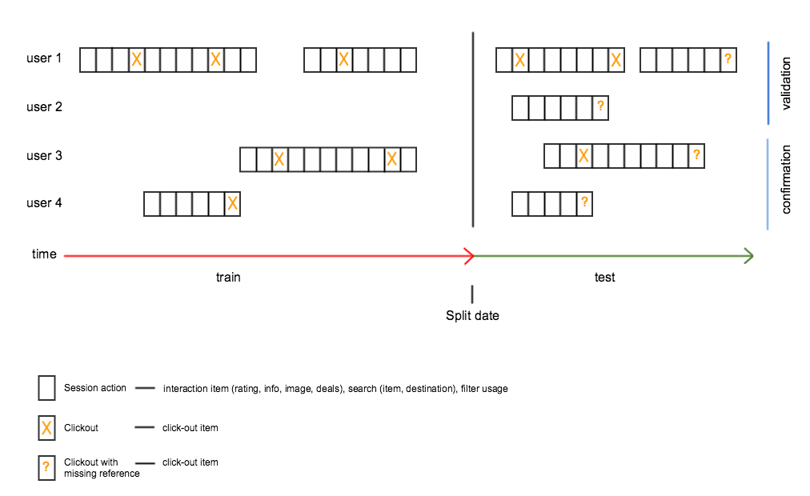
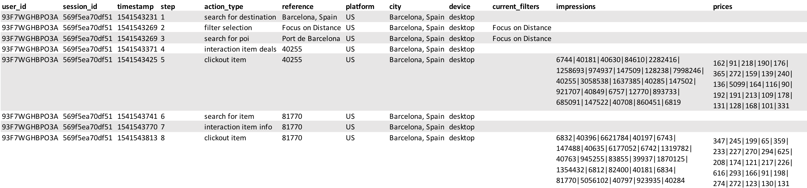

# RecSys Challenge 2019

## Problem-definition

In this challenge, participants are confronted with a click-prediction problem that can be tackled by building a recommendation system based on sequences of user interactions (sessions). The goal is to detect the intent of the user and to update the recommendation of accommodations (items) provided to the user. Given a dataset of the interactions of the users on our website and metadata for the items they interacted with, the participants are tasked with recommending items that have a high chance of being clicked in the later part of a session.

The input consists of a training dataset that contains session and interaction data of users up to a specified time (split date). The training data can be used to build models of user interactions and contains information about the type of action that has been performed (filter usage, search refinements, item interactions, item searches, item click-outs) as well as information about impressed items and prices at the time of a click-out.

The recommendations should be provided for a test set that contains information about sessions after the split date but is missing the information about the accommodations that have been clicked in the last part of the sessions. The required output is a list of maximum 25 items for each click-out ordered by preferences for the specific user. The higher the actually clicked item appears on the list the higher the score.

The following schematic illustrates the problem setting and the separation of the data into training and test sets.

## Evaluation

We use the [mean reciprocal rank](https://en.wikipedia.org/wiki/Mean_reciprocal_rank) as the metric to evaluate the submissions. We will provide a leaderboard that is displaying the metric calculated for a subset of users (validation group). The final scores will be calculated on a different set of users (confirmation group) at the end of the challenge.

    Example

    query 1:
    impressions     = [100, 101, 102, 103, 104, 105] 
    clicked_item_id = 102  
    submission      = [101, 103, 104, 102, 105, 100] 

    reciprocal rank = 0.25

    query 2:
    impressions     = [101, 103, 104, 100, 105]
    clicked_item_id = 105
    submission      = [103, 105, 101, 100, 104]

    reciprocal rank = 0.5

    mrr = (0.25 + 0.5) / 2 = 0.375

## Data

The data will be provided on the official website of the challenge: [trivago RecSys Challenge](https://recsys.trivago.cloud/).

### Session actions (train.csv and test.csv) 

* `user_id`: identifier of the user
* `session_id`: identifier of each session
* `timestamp`: UNIX timestamp for the time of the interaction
* `step`: step in the sequence of actions within the session
* `action_type`: identifier of the action that has been taken by the user.
    * **clickout item**: user makes a click-out on the item and gets forwarded to a partner website. The reference value for this action is the item_id. Other items that were displayed to the user and their associated prices are listed under the 'impressions' and 'prices' column for this action.
    * **interaction item rating**: user interacts with a rating or review of an item.
    The reference value for this action is the item id.
    * **interaction item info**: user interacts with item information.
    The reference value for this action is the item id.
    * **interaction item image**: user interacts with an image of an item.
    The reference value for this action is the item id.
    * **interaction item deals**: user clicks on the view more deals button.
    The reference value for this action is the item id.
    * **change of sort order**: user changes the sort order.
    The reference value for this action is the sort order description.
    * **filter selection**: user selects a filter.
    The reference value for this action is the filter description.
    * **search for item**: user searches for an accommodation.
    The reference value for this action is the item id.
    * **search for destination**: user searches for a destination.
    The reference value for this action is the name of the destination.
    * **search for poi**: user searches for a point of interest (POI).
    The reference value for this action is the name of the POI.
* `reference`: reference value of the action as described for the different action types
* `platform`: country platform that was used for the search, e.g. trivago.de (DE) or trivago.com (US)
* `city`: name of the current city of the search context
* `device`: device that was used for the search
* `current_filters`: list of pipe-separated filters that were active at the given timestamp
* `impressions`: list of pipe-separated items that were displayed to the user at the time of a click-out (see action_type = clickout_item)
* `prices`: list of pipe-separated prices of the items that were displayed to the user at the time of a click-out (see action_type = clickout_item)

### Item metadata (item_metadata.csv)

* `item_id`: identifier of the accommodation as used in the reference values for item related action types, e.g. clickout_item and item interactions, and impression list
* `properties`: pipe-separated list of filters that are applicable for the given item

## Submission

The submission should consist of a list of recommended hotels for each click-out that is missing in the test set. The format of the submission should allow to unambiguously identify the click-out in question.

Therefore the submission file should be structured in the following way:

* `user_id`: identifier of the user that made the click-out
* `session_id`: identifier of the session in which the click-out was made
* `timestamp`: UNIX timestamp of the click-out
* `step`: step in the sequence of actions that marks the click-out
* `item_recommendations`: Space-separated list of items that the user will most likely have clicked

## Explanation of user actions in a sample session

In this session, a user from the US platform has used trivago on a desktop device. The actions in this session are the following:

1. (action type: search for destination, reference: Barcelona, Spain): User searches for Barcelona, Spain.
2. (action type: filter selection, reference: Focus on Distance): The 'focus on distance' filter is activated. At this point the current_filters column indicates that this is the only filter that is active.
3. (action type: search for poi, reference: Port de Barcelona): User searches for a point-of-interest (POI), the Port de Barcelona.
4. (action type: interaction item deals, reference: 40255): User viewed at the 'More Deals' button on item 40255.  The 'focus on distance' filter is no longer activated.
5. (action type: clickout item, reference: 40225): The user clicks out on item 40225.  The full list of displayed items and their associated prices can be seen in the 'impressions' and 'price' columns.
6. (action type: search for item, reference: 81770): User searches for item 81770.
7. (action type: interaction item info, reference: 81770): User interacts with the item information of item 81770.
8. (action type: clickout item, reference: 81770): User clicks out on item 81770. The full list of items and their associated prices can be seen in the 'impressions' and 'price' columns.
